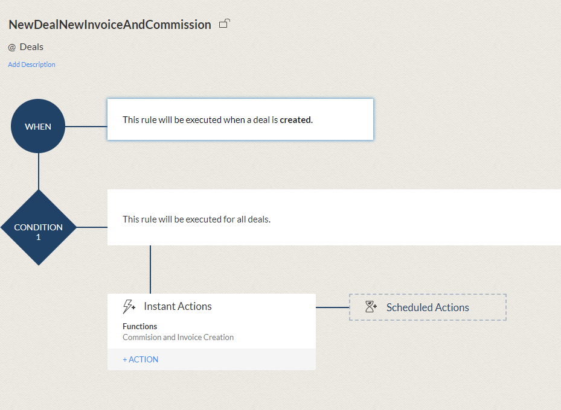

# commission_and_invoice_creation

When a new deal is created in Zoho CRM, an invoice will be created in Books. Additionally, two commission records will be created in the Commission module; one for the financial planner and one for the deal owner. 
Practice function for coursework in The Workflow Academy.

